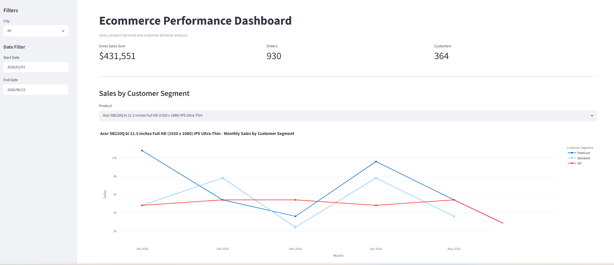
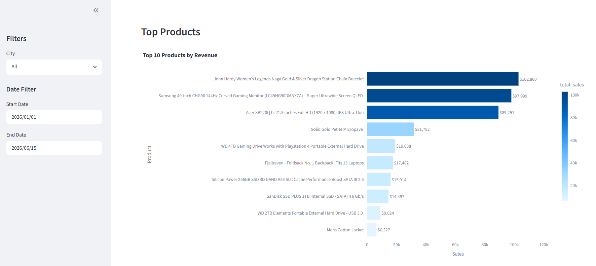
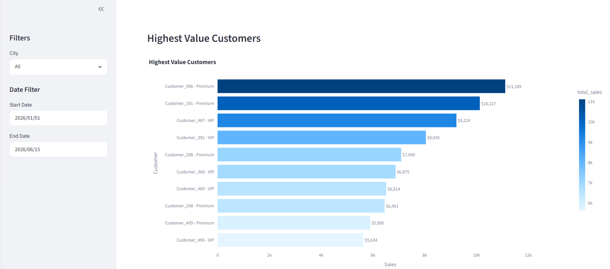
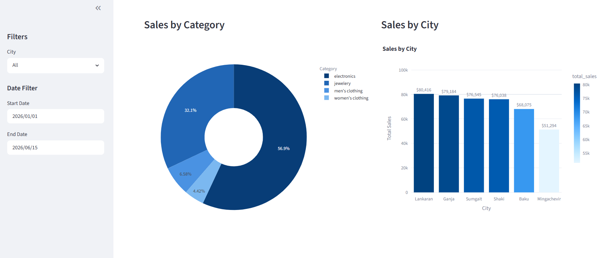
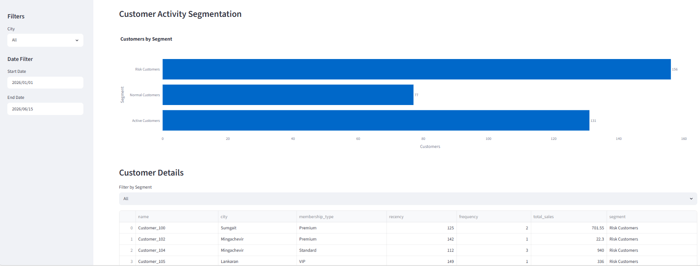

# Ecommerce Performance Dashboard

This project is an e-commerce dashboard built with Python, PostgreSQL, Streamlit, Plotly and Pandas.

The goal of the project is to collect, store, analyze, and visualize e-commerce data through an interactive dashboard.

## Data Sources

### Products

Product data is retrieved from a public REST API using Python Requests. The API returns data in JSON format, which is processed with Pandas and loaded into PostgreSQL.

### Orders

Order data is generated and stored as CSV files before being loaded into PostgreSQL.

### Customers and Reviews

Customer and review data are generated in JSON format, processed with Pandas, and loaded into PostgreSQL.

---

## Dashboard Features

### Sales Analytics

* Total Sales Overview
* Monthly Sales Analysis
* Sales by Category
* Sales by City

### Customer Analytics

* Total Customers
* Highest Value Customers
* Customer Membership Analysis

### Customer Activity Segmentation

Customers are segmented based on their latest purchase activity to help identify engagement levels and potential retention risks.

## Customer segments:

* Active Customers (0-30 days since last purchase)
* Normal Customers (31-60 days since last purchase)
* Risk Customers (60+ days since last purchase)

This analysis helps monitor customer activity and identify customers who may require retention campaigns.

### Product Analytics

* Top Selling Products
* Product Performance Analysis

### Interactive Filters

* City Filter
* Date Range Filter
* Product Filter

## Technologies Used

### Programming & Data Analysis

* Python
* Pandas

### Data Collection

* Requests
* REST API
* JSON Data
* CSV Data

### Database

* PostgreSQL
* SQLAlchemy

### Dashboard & Visualization

* Streamlit
* Plotly

## Database Tables

* customers
* products
* orders
* reviews

## Setup

pip install -r requirements.txt

Create .env file:

DATABASE_URL=your_database_url

## Run:

streamlit run app.py

## Dashboard Preview

### Sales by Customer Segment

### Top Products by Revenue

### Highest value customers

### Sales by Category and City

### Customer Activity Segmentation

